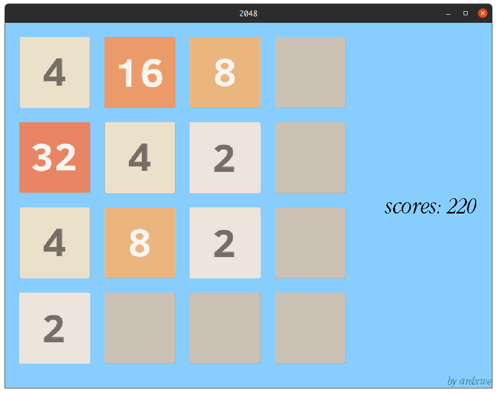

# 2048

## 介绍

- `s` 开始
- 方向键移动
- 记录得分


## 需求

```bash
$ sudo apt-get install libsdl2-dev
```

## 构建
```bash
$ mkdir build
$ cd build
$ cmake -DCMAKE_BUILD_TYPE=Release ..
$ cmake --build . 
```

## 运行

```bash
$ ./2048
```

## 截图


